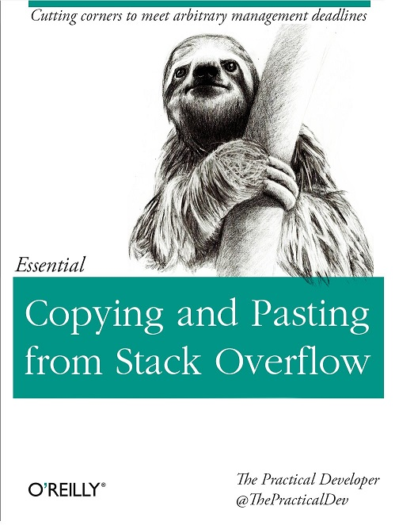
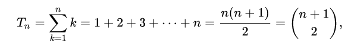

- title : Concurrent data structures with examples in Azure Service Bus
- description : Concurrent data structures with examples in Azure Service Bus
- author : Daniel Marbach
- theme : night
- transition : default

***

### Concurrent data structures   with examples in Azure Service Bus

[@danielmarbach](https://www.twitter.com/danielmarbach) 
[www.planetgeek.ch](https://www.planetgeek.ch)

---

### Introduction

- The examples in this presentation use the [WindowsAzure.ServiceBus](https://www.nuget.org/packages/WindowsAzure.ServiceBus/) approach to illustrate a problem. The package should no longer be used. If you plan to use Azure Service Bus use [Microsoft.Azure.ServiceBus](https://www.nuget.org/packages/Microsoft.Azure.ServiceBus/) or even better [Azure.Messaging.ServiceBus](https://www.nuget.org/packages/Azure.Messaging.ServiceBus)
- For brevity and readability `ConfigureAwait(false)` has been left out and opionated braces placement has been used (You have been warned!)
- If you see spelling mistakes, I accept Pull Requests ;)

---

### Why am I telling you this?

---

> **Stackoverflow Law**: Good coders borrow, great coders steal. [The Internet](https://stackoverflow.blog/2020/05/20/good-coders-borrow-great-coders-steal/)

***

### Receive/Complete messages

    [lang=cs]
    var factory1 = await MessagingFactory.CreateAsync(address, settings);
    var factory2 = await MessagingFactory.CreateAsync(address, settings;
    var receiver1 = await factory1.CreateMessageReceiverAsync(queueName, ReceiveMode.PeekLock);
    var receiver2 = await factory2.CreateMessageReceiverAsync(queueName, ReceiveMode.PeekLock);

    receiver1.OnMessageAsync(msg => ReceiveMessage(msg, receiver1), ..);
    receiver2.OnMessageAsync(msg => ReceiveMessage(msg, receiver2), ..);

    static async Task ReceiveMessage(BrokeredMessage message, MessageReceiver receiver) {
        // process message
        await receiver.CompleteAsync(message.LockToken)
    }

- MessagingFactory = Dedicated TCP connection --> faaast!
- Every `CompleteAsync` is a dedicated call to the cloud --> slooow!

---

### Can we do better?

    [lang=cs]
    var lockTokensToComplete = new ConcurrentStack<Guid>();

    static async Task ReceiveMessage(BrokeredMessage message) {
        // process message
        lockTokensToComplete.Push(message.LockToken);
    }

' Why `ConcurrentStack` instead of `ConcurrentQueue`? Honestly this code predates me. I guess because the stack contains a `TryPopRange` method

---

### We need someone to complete the tokens

    [lang=cs]
    var tokenSource = new CancellationTokenSource();
    var token = tokenSource.Token;

    var batchCompletionTask = Task.Run(async () => {
        while(!token.IsCancellationRequested) {
            var lockTokens = new Guid[100];
            int numberOfItems = lockTokensToComplete.TryPopRange(lockTokens)
            if(numberOfItems > 0) {
                await receiveClient.CompleteBatchAsync(lockTokens);
            }
            await Task.Delay(TimeSpan.FromSeconds(5), token);
        }
    });

' Under small load, we complete lock tokens in in batches of one to maximum one hundred tokens.
' If we receive only a limited number of messages, the loop might complete messages with their tokens one by one (for example when we receive a message every 6 seconds). But what happens when the load increases?
' When we’d received several hundred messages per seconds our randomly chosen “complete every one-hundredth messages” and then “sleep for five seconds” might turn out to be a suboptimal choice
' https://www.planetgeek.ch/2016/12/05/another-attempt-to-batch-complete-with-azure-service-bus/

---

### Under concurrency, things might spin

    [lang=cs]
    static async Task ReceiveMessage(BrokeredMessage message) {
        // process message
        lockTokensToComplete.Push(message.LockToken);
    }

- `NumberOfReceivers` * `ConcurrencyPerReceiver` will push to the concurrent stack

' So for example when we’d use 10 receivers with each a concurrency setting of 32 we’d be ending up pushing lock tokens to the concurrent stack from up to 320 simultaneous operations

---

> **Are all of the new concurrent collections lock-free?**: ConcurrentQueue<T> and ConcurrentStack<T> are completely lock-free in this way. They will never take a lock, but they may end up spinning and retrying an operation when faced with contention [Old Post](https://blogs.msdn.microsoft.com/pfxteam/2010/01/26/faq-are-all-of-the-new-concurrent-collections-lock-free/)

' Of course the concurrent data structures are getting improved, still spinning and retrying is something that has to be taken into account

---

### Under load we might not keep up

- Concurrent receivers can fill the concurrent stack faster with lock tokens than our completion loop manage to complete
- Increased change of lock lost problems under peek lock

---

### Let's fix that

    [lang=cs]
    var completionTasks = new Task[numberOfReceivers];

    for(int i = 0; i < numberOfReceivers; i++) {
        completionTasks[i] = Task.Run(() => BatchCompletionLoop());
    }

    static async Task BatchCompletionLoop() {
        while(!token.IsCancellationRequested) {
            var lockTokens = new Guid[100];
            int numberOfItems = lockTokensToComplete.TryPopRange(lockTokens)
            if(numberOfItems > 0) {
                await receiveClient.CompleteBatchAsync(lockTokens);
            }
            await Task.Delay(TimeSpan.FromSeconds(5), token);
        }
    }

---

- Contention problem is even worse, multiple background completion operations are competing on the concurrent stack
- Same `Task.Delay` without jitter causes a lot to wake up and potentially not succed, wasting a lot of resources

' Even if we had jitter latency might make loops align again over time
' https://www.planetgeek.ch/2016/12/14/batch-completion-with-multiple-receivers-on-azure-service-bus/

---

### There is a dragon hiding here

    [lang=cs]
    await receiveClient.CompleteBatchAsync(lockTokens);

- Complete always on the same receiver
-  Works with SBMP (NetMessaging) but fails with AMQP as a transport type

---

### Surely we can fix that too?

    [lang=cs]
    var tokensToComplete = new ConcurrentStack<Guid>[numberOfReceivers];
    // initialize the concurrent stacks

    receiveClient1.OnMessageAsync(message =>
        ReceiveMessage(message, tokensToComplete[0]);
    ...
    receiveClientN.OnMessageAsync(message =>
        ReceiveMessage(message, tokensToComplete[N-1]);

    static async Task ReceiveMessage(BrokeredMessage message,
        ConcurrentStack<Guid> tokensToComplete) {

        // process message
        tokensToComplete.Push(message.LockToken);

    }

---

### ... and the completion

    [lang=cs]
    for(int i = 0; i < numberOfReceivers; i++) {
        completionTasks[i] = Task.Run(() =>
            BatchCompletionLoop(receivers[i], lockTokensToComplete[i]));
    }

    static async Task BatchCompletionLoop(MessageReceiver receiver,
        ConcurrentStack<Guid> lockTokensToComplete) {

        while(!token.IsCancellationRequested) {
            var lockTokens = new Guid[100];
            int numberOfItems = lockTokensToComplete.TryPopRange(lockTokens)
            if(numberOfItems > 0) {
                await receiver.CompleteBatchAsync(lockTokens);
            }
            await Task.Delay(TimeSpan.FromSeconds(5), token);
        }
    }

---

### What have we achieved?

- Contention is mostly gone
- Completion is guaranteed to use the same receiver to complete
 
 

### but...

---

- Still wasting a lot of resources due to the wakeup and idle pattern
- Code doesn't really have the necessary elasticity

***

### Multi Producer Concurrent Consumer

- Make sure messages are only completed on the receiver they came from
- Reduce the number of threads used when the number of clients is increased
- Autoscale up under heavy load
- Scale down under light load
- Minimise the contention on the underlying collections used

---

- Be completely asynchronous
- Implements a push based model from the producer and consumer perspective
- Respect the maximum batch sized defined by the client of the component or a predefined push interval
- Provide FIFO semantics instead of LIFO
- Be as lock-free as possible

---

---

    [lang=cs]
    class MultiProducerConcurrentConsumer<TItem> {
        public MultiProducerConcurrentConsumer(
            int batchSize, TimeSpan pushInterval,
            int maxConcurrency, int numberOfSlots) { }

        public void Start(Func<List<TItem>, int, object, CancellationToken, Task> pump) { }

        public void Start(Func<List<TItem>, int, object, CancellationToken, Task> pump, object state) { }

        public void Push(TItem item, int slotNumber) { }

        public async Task Complete(bool drain = true) { }
    }

' https://www.planetgeek.ch/2017/01/17/introduction-to-the-multiproducerconcurrentconsumer-for-azure-service-bus-message-completion/

---

### Pre-allocate and reuse

- Allocate as much as you need upfront
- Allocate on-demand when you need it

---

    [lang=cs]
    public MultiProducerConcurrentCompletion(int batchSize, TimeSpan pushInterval,
        int maxConcurrency, int numberOfSlots) {

        queues = new ConcurrentQueue<TItem>[numberOfSlots];
        for (var i = 0; i < numberOfSlots; i++) {
            queues[i] = new ConcurrentQueue<TItem>();
        }

        var maxNumberOfConcurrentOperationsPossible = numberOfSlots * maxConcurrency;
        pushTasks = new List<Task>(maxNumberOfConcurrentOperationsPossible);

        itemListBuffer = new ConcurrentQueue<List<TItem>>();
        for (var i = 0; i < maxNumberOfConcurrentOperationsPossible; i++) {
            itemListBuffer.Enqueue(new List<TItem>(batchSize));
        }
    }

' The benefit of only allocating when needed is that the memory consumption only grows when it is needed. The downside of this approach is that under highly concurrent scenarios allocating structures in a safe and lock-free way can be tricky.
' https://www.planetgeek.ch/2017/01/19/multiproducerconcurrentconsumer-preallocate-and-reuse/

---

### Let's get started

    [lang=cs]
    public void Start(Func<List<TItem>, int, object, CancellationToken, Task> pump)
        => Start(pump, null);

    public void Start(Func<List<TItem>, int, object, CancellationToken, Task> pump,
        object state) {

        if (started)
            throw new InvalidOperationException("Already started");

        tokenSource = new CancellationTokenSource();
        timer = Task.Run(TimerLoop);
        this.pump = pump;
        this.state = state;
        started = true;
    }

- State based overload helps to avoid closure capturing

---

### It's time to push

    [lang=cs]
    async Task TimerLoop() {
        var token = tokenSource.Token;
        while (!tokenSource.IsCancellationRequested) {
            try {
                await Task.Delay(pushInterval, token);
                await PushInBatches();
            }
            catch (Exception) {
                // intentionally ignored
            }
        }
    }

- Achievement: Push items in batches based on the push interval

' https://www.planetgeek.ch/2017/01/31/multiproducerconcurrentconsumer-start-it/

---

### Push it real good

    [lang=cs]
    public void Push(TItem item, int slotNumber) {
        if (slotNumber >= numberOfSlots)
            throw new ArgumentOutOfRangeException(...);

        queues[slotNumber].Enqueue(item);

        var incrementedCounter = Interlocked.Increment(ref numberOfPushedItems);

        if (incrementedCounter > batchSize) {
            batchSizeReached.TrySetResult(true);
        }
    }

- Simple tradeoff: Global counter to reduce complexity

---

### There is enough to push

    [lang=cs]
    async Task TimerLoop() {
        var token = tokenSource.Token;
        while (!tokenSource.IsCancellationRequested) {
            try {
                await Task.WhenAny(Task.Delay(pushInterval, token), batchSizeReached.Task);
                batchSizeReached.TrySetResult(true);
                batchSizeReached =
                    new TaskCompletionSource<bool>(
                        TaskCreationOptions.RunContinuationsAsynchronously);
                await PushInBatches();
            }
            catch (Exception)
            {
                // intentionally ignored
            }
        }
    }

' https://www.planetgeek.ch/2017/02/01/multiproducerconcurrentconsumer-push-it/

---

### Push it in batches

    [lang=cs]
    Task PushInBatches() {
        if (Interlocked.Read(ref numberOfPushedItems) == 0) {
            return TaskEx.Completed;
        }

        for (var i = 0; i < numberOfSlots; i++) {
            var queue = queues[i];

            PushInBatchesUpToConcurrencyPerQueueForAGivenSlot(queue, i, pushTasks);
        }

        return Task.WhenAll(pushTasks).ContinueWith((t, s) => {
            var tasks = (List<Task>)s;
            tasks.Clear();
        }, pushTasks, TaskContinuationOptions.ExecuteSynchronously);
    }

---

### Now it gets a little bit crazy

    [lang=cs]
    void PushInBatchesUpToConcurrencyPerQueueForAGivenSlot(ConcurrentQueue<TItem> queue,
        int currentSlotNumber, List<Task> tasks) {
        int numberOfItems;
        var concurrency = 1;
        do {
            // magic sauce
        }
        while (numberOfItems == batchSize && concurrency <= maxConcurrency);
    }

---

    [lang=cs]
    void PushInBatchesUpToConcurrencyPerQueueForAGivenSlot(ConcurrentQueue<TItem> queue,
        int currentSlotNumber, List<Task> tasks) {
        int numberOfItems;
        var concurrency = 1;
        do {
            numberOfItems = 0;
            List<TItem> items = null;
            for (var i = 0; i < batchSize; i++) {
                if (!queue.TryDequeue(out var item)) {
                    break;
                }

                if (items == null && !itemListBuffer.TryDequeue(out items)) {
                    items = new List<TItem>(batchSize);
                }

                items.Add(item);
                numberOfItems++;
            }

            // more magic sauce
        }
        while (numberOfItems == batchSize && concurrency <= maxConcurrency);
    }

---

    [lang=cs]
    void PushInBatchesUpToConcurrencyPerQueueForAGivenSlot(ConcurrentQueue<TItem> queue,
        int currentSlotNumber, List<Task> tasks) {
        int numberOfItems;
        var concurrency = 1;
        do {
            // previous magic sauce

            if (numberOfItems <= 0) {
                return;
            }

            Interlocked.Add(ref numberOfPushedItems, -numberOfItems);
            concurrency++;
            var task = pump(items, currentSlotNumber, state, tokenSource.Token)
                .ContinueWith((t, taskState) =>
            {
                var itemListAndListBuffer =
                    (Tuple<List<TItem>, ConcurrentQueue<List<TItem>>>)taskState;
                itemListAndListBuffer.Item1.Clear();
                itemListAndListBuffer.Item2.Enqueue(itemListAndListBuffer.Item1);
            }, Tuple.Create(items, itemListBuffer), TaskContinuationOptions.ExecuteSynchronously);
            tasks.Add(task);
        }
        while (numberOfItems == batchSize && concurrency <= maxConcurrency);
    }

---

### Give me the full picture you damn code cheater

    [lang=cs]
    void PushInBatchesUpToConcurrencyPerQueueForAGivenSlot(ConcurrentQueue<TItem> queue,
        int currentSlotNumber, List<Task> tasks) {
        int numberOfItems;
        var concurrency = 1;
        do {
            numberOfItems = 0;
            List<TItem> items = null;
            for (var i = 0; i < batchSize; i++) {
                if (!queue.TryDequeue(out var item)) {
                    break;
                }

                if (items == null && !itemListBuffer.TryDequeue(out items)) {
                    items = new List<TItem>(batchSize);
                }

                items.Add(item);
                numberOfItems++;
            }

            if (numberOfItems <= 0) {
                return;
            }

            Interlocked.Add(ref numberOfPushedItems, -numberOfItems);
            concurrency++;
            var task = pump(items, currentSlotNumber, state, tokenSource.Token).ContinueWith((t, taskState) =>
            {
                var itemListAndListBuffer = (Tuple<List<TItem>, ConcurrentQueue<List<TItem>>>)taskState;
                itemListAndListBuffer.Item1.Clear();
                itemListAndListBuffer.Item2.Enqueue(itemListAndListBuffer.Item1);
            }, Tuple.Create(items, itemListBuffer), TaskContinuationOptions.ExecuteSynchronously);
            tasks.Add(task);
        }
        while (numberOfItems == batchSize && concurrency <= maxConcurrency);
    }

    ' https://www.planetgeek.ch/2017/03/07/multiproducerconcurrentconsumer-push-in-batches-up-to-concurrency-per-slot/

### How on earth would we test this beast?

    [lang=csharp]
    public async Task Pushing_for_slots_after_start_works_when_batch_size_is_reached() {
        var receivedItems = new ConcurrentQueue<List<int>>[4] {
            new ConcurrentQueue<List<int>>(),
            new ConcurrentQueue<List<int>>(),
            new ConcurrentQueue<List<int>>(),
            new ConcurrentQueue<List<int>>(),
        };

        var countDownEvent = new CountdownEvent(16);

        // choose insanely high push interval
        var completion = new MultiProducerConcurrentCompletion<int>(batchSize: 100,
            pushInterval: TimeSpan.FromDays(1), maxConcurrency: 4, numberOfSlots: 4);

        // Asserts
    }

---

    [lang=csharp]
    public async Task Pushing_for_slots_after_start_works_when_batch_size_is_reached() {
        // Previous arrange

        completion.Start(async (items, slot, state, token) => {
            await Task.Yield();
            receivedItems[slot].Enqueue(new List<int>(items)); // take a copy
            if (!countDownEvent.IsSet)
            {
                countDownEvent.Signal();
            }
        });

        var numberOfItems = await PushConcurrentlyTwoThousandItemsInPackages
            OfFiveHundredIntoFourSlots(completion);

        // we wait for 16 counts and then complete midway
        await Task.Run(() => countDownEvent.Wait(TimeSpan.FromSeconds(5)));

        await completion.Complete();

        Assert.AreEqual(TriangularNumber(numberOfItems), Flatten(receivedItems).Sum(i => i));
    }

---

    [lang=csharp]
    public async Task Pushing_for_slots_after_start_works_when_batch_size_is_reached() {
        var receivedItems = new ConcurrentQueue<List<int>>[4] {
            new ConcurrentQueue<List<int>>(),
            new ConcurrentQueue<List<int>>(),
            new ConcurrentQueue<List<int>>(),
            new ConcurrentQueue<List<int>>(),
        };

        var countDownEvent = new CountdownEvent(16);

        // choose insanely high push interval
        var completion = new MultiProducerConcurrentCompletion<int>(batchSize: 100,
            pushInterval: TimeSpan.FromDays(1), maxConcurrency: 4, numberOfSlots: 4);

        completion.Start(async (items, slot, state, token) =>s {
            await Task.Yield();
            receivedItems[slot].Enqueue(new List<int>(items)); // take a copy
            if (!countDownEvent.IsSet)
            {
                countDownEvent.Signal();
            }
        });

        var numberOfItems = await PushConcurrentlyTwoThousandItemsInPackages
            OfFiveHundredIntoFourSlots(completion);

        // we wait for 16 counts and then complete midway
        await Task.Run(() => countDownEvent.Wait(TimeSpan.FromSeconds(5)));

        await completion.Complete();

        Assert.AreEqual(TriangularNumber(numberOfItems), Flatten(receivedItems).Sum(i => i));
    }

---

    [lang=csharp]
    int TriangularNumber(int numberOfItems) {
        return numberOfItems*(numberOfItems + 1)/2;
    }

---

    [lang=csharp]
    IEnumerable<int> Flatten(ConcurrentQueue<List<int>>[] captured) {
        var allCaptured = new List<int>();
        foreach (var queue in captured) {
            foreach (var list in queue.ToArray())
            {
                allCaptured.AddRange(list);
            }
        }
        return allCaptured.OrderBy(i => i);
    }

---

    [lang=csharp]
    static async Task<int> PushConcurrentlyTwoThousandItemsInPackagesOf
        FiveHundredIntoFourSlots(MultiProducerConcurrentCompletion<int> completion)
    {
        var t1 = Task.Run(() => Parallel.For(1, 500, i => {
            completion.Push(slotNumber: 0, item: i);
        }));

        var t2 = Task.Run(() => Parallel.For(500, 1000, i => {
            completion.Push(slotNumber: 1, item: i);
        }));

        var t3 = Task.Run(() => Parallel.For(1000, 1500, i => {
            completion.Push(slotNumber: 2, item: i);
        }));

        await Task.WhenAll(t1, t2, t3);

        var numberOfItems = 2000;
        for (var i = 1500; i < numberOfItems + 1; i++)
        {
            completion.Push(slotNumber: 3, item: i);
        }
        return numberOfItems;
    }

***

## Recap

- With the built-in tools we can already achieve quite nice structures for concurrent programming
- Today some of the inner workings could be replaced with `System.Threading.Channel`
- I encourage you got go through the tests and the code or even build it yourself from scratch, you'll learn a ton

***

## Links

- [GitHub](https://www.github.com/danielmarbach/ConcurrentDatastructures.Webinar)
- [Twitter](https://www.twitter.com/danielmarbach)
- [Slides Online](https://danielmarbach.github.io/ConcurrentDataStructures.Webinar)